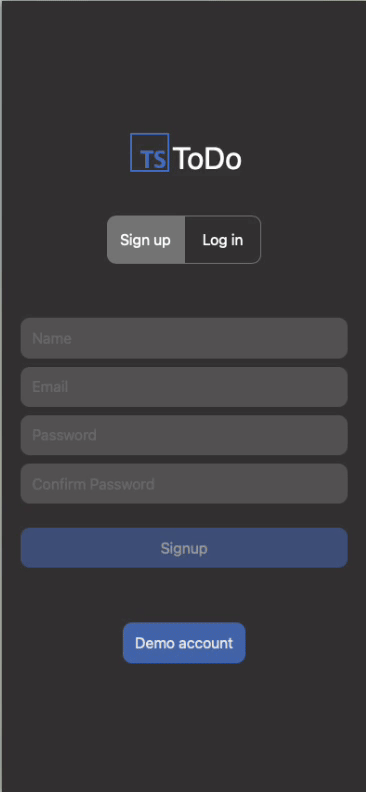
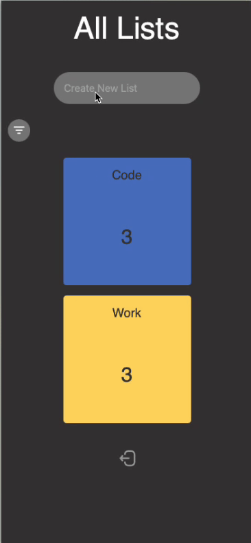

# TS-ToDo

---

## About this project

This was a personal project aimed at expanding and deepening my understanding of my tech stack By incorporating PSQL, Redux and developing both the front and back and in TypeScript. 

This is a full stack to do list application written in Typescript, showcasing Industry standard authentication, A clean front end design With the implementation of Redux To enable optimistic updates for a graceful useful experience. 

---

## Technologies

TypeScript

CSS

React - TS

Redux

Express - TS

PSQL

JWT's

---
## Live Link

https://ts-todo-amuk.vercel.app

---

## Screenshots

### Gif 1

### Gif 2

